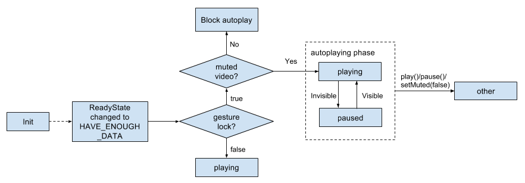
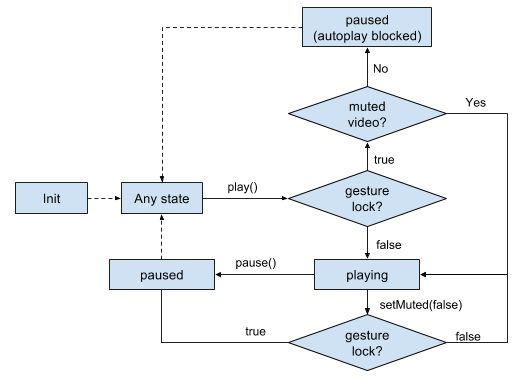

# Autoplay of HTMLMediaElements

Autoplay is the concept of playing media elements without user gesture. On
desktop, autoplay is always allowed. On mobile, only muted video elements are
allowed to autoplay. The autoplay logic follows
the
[HTML spec](https://html.spec.whatwg.org/multipage/embedded-content.html#media-elements).

There are two ways of initiating autoplay:

* Autoplay by attribute: Setting the `autoplay` attribute on the media element.
  The element will try to autoplay when the `readyState` changes to
  HAVE_ENOUGH_DATA.
* Autoplay by `play()` method: Explicitly calling the `play()` method without
  user gesture.

## User gesture lock

Each media element has a user gesture lock. If the element is allowed to
autoplay, the lock is initialized as `false`, otherwise it's `true`.

When the element is trying to initate autoplay, we check the gesture lock. If
the lock is `false`, it will be allowed. Otherwise autoplay will be blocked. An
exception is that if the element is a muted video element, the gesture lock
check will be bypassed.

To unlock the gesture lock (make it `false`). The page needs to call play() or
load() on the element when responding to a user gesture.

## Autoplay flowchart

The treatments of autoplay by different methods are different. For autoplay by
attribute, it is:

This means if autoplay is initiated by attribute, it enters the autoplaying
phase, we play it as long as the video is visible. When the page explicitly
calls `play()`, `pause()`, we leave the autoplaying phase. When the page tries
to unmute the video, we check the gesture lock and pause the video if it is
still `true`.

For autoplay by `play()` method, it is:

This means if autoplay is initiated by `play()` method, we continue playing the
video as normal `play()`. However if the page tries to unmute the video, we check
the gesture lock and pause the video if it is still `true`.
